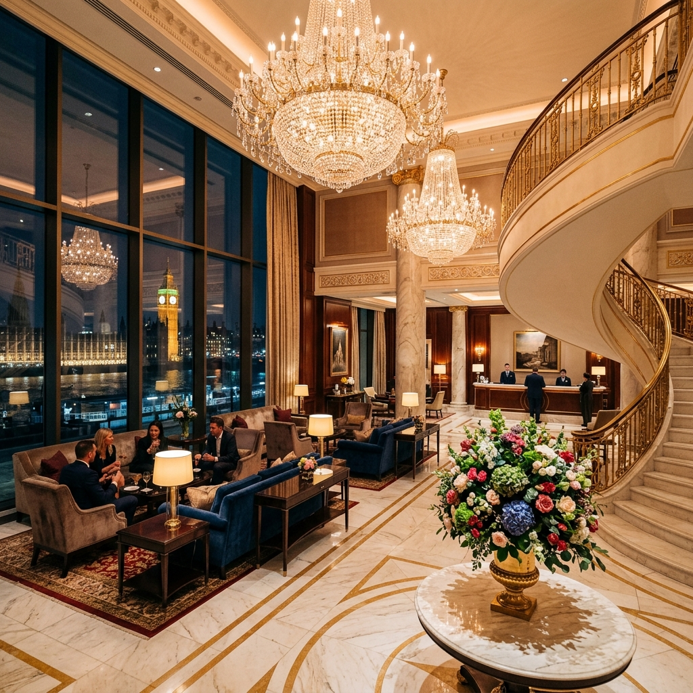

# The RBGm London



A comprehensive, production-ready Next.js 14 web application designed for a luxury 5-star hotel in London. This project was meticulously crafted to serve families, VIPs, and luxury travelers, featuring an elegant design aesthetic and complete hotel service offerings.

## Overview

The RBGm London website represents a premium online presence for one of London's finest hotels (voted best for five consecutive years). The platform serves as both an informational brochure and a digital concierge, carefully curated by the hotel's General Manager.

### Core Features

- **Guest Services Directory:** Comprehensive guide covering arrival, daily services, local information, and special request handling.
- **Rooms & Suites Showcase:** Gallery of accommodations ranging from Deluxe rooms to the Royal Penthouse with specific amenities.
- **Culinary Experience:** Details for Michelin-starred *The Amber Room*, *The Drawing Room* afternoon tea, and 24-hour bespoke room service.
- **Mayfair Spa & Wellness:** Treatment menus, facility details, and operating hours.
- **Les Clefs d'Or Concierge:** Specialized services for special occasions, theatre tickets, chauffeur transport, and private tours.
- **Family & Dietary Catering:** Specifically highlighted capabilities for handling children's activities and complex dietary requirements.

## Technologies Used

- **Framework:** Next.js 14 (App Router)
- **Language:** TypeScript
- **Styling:** Custom CSS Modules with a bespoke luxury design system
- **Typography:** `Cormorant Garamond` (Headings) & `Inter` (Body) via Google Fonts
- **Deployment:** Vercel / Next.js optimized

## Design System

The application uses a carefully crafted color palette intended to evoke warmth, tradition, and sophisticated luxury:
- **Primary:** Warm Whites / Creams
- **Secondary:** Charcoal / Dark Browns
- **Accents:** Champagne Golds & Brass

## Getting Started

First, install the dependencies:

```bash
npm install
```

Then, run the development server:

```bash
npm run dev
```

Open [http://localhost:3000](http://localhost:3000) with your browser to see the result.

## Project Structure

```
.
├── app/
│   ├── components/       # Shared UI (Navbar, Footer)
│   ├── concierge/        # Concierge services page
│   ├── contact/          # Interactive contact & booking form
│   ├── dining/           # Restaurant and room service details
│   ├── guest-services/   # Comprehensive guest directory
│   ├── rooms/            # Accommodation showcase
│   ├── spa/              # Wellness center information
│   ├── page.tsx          # Main Landing Page
│   └── globals.css       # Global design system variables
├── public/               # Static assets & AI-generated imagery
└── src/                  # Next.js configurations
```

## License

This project is created for demonstration purposes. All rights reserved by The RBGm Management Group.
